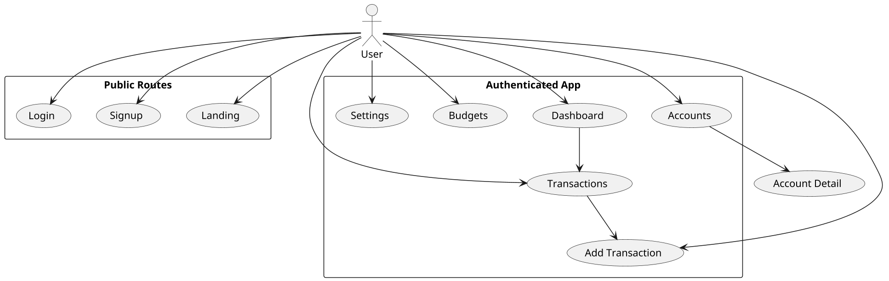
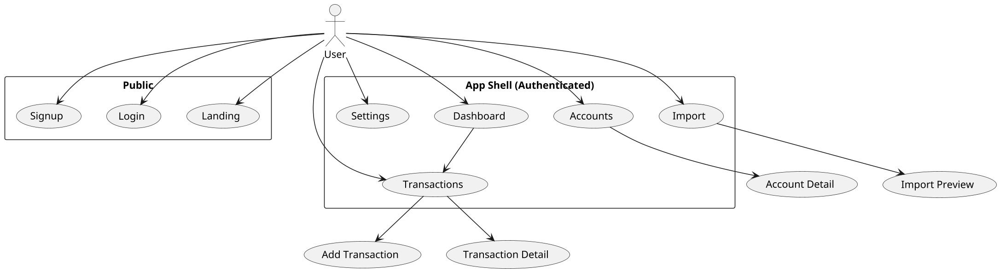

# SPEC-1-Frontend-Design-Plan

## Background

You want to design the React frontend for your Personal Finance SaaS. We will produce a small set of concise, implementable design documents that give developers an exact list of pages, components, navigation, and the API calls each page needs — enough to start building the MVP UI.

---

## Requirements (MoSCoW)

**Must**
- Pages inventory & sitemap (exact page list + routes).  
- Component inventory (atomic components + page composites).  
- Navigation & routing map (how users move between pages).  
- API mapping (which backend endpoints each page calls; tie to OpenAPI).  
- Auth & tenant flows (signup/login/tenant-switch; token storage).  
- Design tokens & basic visual system (colors, spacing, typography).  

**Should**
- Wireframes for every page (low-fi to medium-fi).  
- Component prop contracts / TypeScript interfaces.  
- State management plan (React Query + local/global state).  

**Could**
- Accessibility checklist (WCAG priorities).  
- RTL / i18n plan.  
- Animation/interaction spec.

**Won't (now)**
- Native mobile app specs (defer to Phase 2).  
- Per-tenant feature-flag visuals (defer until rollout).

---

## Method

For each document we will follow this mini-process: purpose → owner → artifacts → acceptance criteria → small PlantUML / diagram (where helpful).

Below are the documents to create first (prioritized) with a one-line definition and expected deliverables.

1. **Pages Inventory & Sitemap** — definitive list of pages and routes for the MVP.
   - Deliverables: ordered page list, route paths (React Router format), protected vs public, auth & tenant context requirement per route.
   - Acceptance: Developer can scaffold `src/pages/*` and `AppRouter` without further questions.

2. **Navigation & Route Map (PlantUML)** — visual flow showing navigation, modal flows, and tenant switching.
   - Deliverables: PlantUML sequence/flow and route transitions for main flows (signup → onboarding → dashboard; add expense; CSV import flow).
   - Acceptance: QA can follow flows and mark missing transitions.

3. **Component Inventory (Atomic Design)** — catalog of atoms, molecules, organisms and page compositions.
   - Deliverables: list of components, one-line responsibility, props sketch, where used (pages), and accessibility notes.
   - Acceptance: Frontend dev can create storybook stories for each component from the list.

4. **API Endpoint Mapping (OpenAPI → UI)** — map page → API calls (method, path, auth, request body, expected response), error cases and caching rules.
   - Deliverables: table per page mapping to OpenAPI operations (use `openAPI_spec.json` as source), caching & invalidation rules for React Query.
   - Acceptance: Team can implement `api/` client hooks and unit tests using the mapping.

5. **State & Data Layer Design** — global vs page-local state, query keys, optimistic updates, error handling strategies.
   - Deliverables: recommended stack (React Query + Context + Zustand? — assume React Query + Context for tenant/auth), query key naming, mutation patterns.
   - Acceptance: Devs can implement `useTransactions`, `useAccounts`, `useTenants` hooks with predictable keys.

6. **Wireframes & Interaction Notes** — medium-fidelity wireframes for every page and component edge cases (empty states, errors, confirmations).
   - Deliverables: annotated wireframes (Figma links or PNGs) and acceptance scenarios.
   - Acceptance: UI devs and designers agree on spacing and component reuse.

7. **Visual Design Tokens & Storybook** — tokens + Storybook catalog for components.
   - Deliverables: token JSON (colors, fonts, spacings), Storybook setup with stories for atoms.
   - Acceptance: Designers and devs can reuse tokens and produce UI identical to wireframes.

8. **Testing & QA Plan** — unit + integration + e2e responsibilities per page.
   - Deliverables: testing checklist, example Jest + React Testing Library tests, Cypress happy-path scenarios.
   - Acceptance: CI passes basic UI smoke tests for critical flows.

---

## Example PlantUML — top-level navigation flow

---

## Implementation (how to produce each doc)

- **Owner:** You (PM/Founder) or technical lead — decide and assign per doc.  
- **Tooling:** Figma (wireframes), PlantUML (diagrams), Storybook (components), Markdown (docs), GitHub for versioning.  
- **Templates:** provide a short template for each doc (purpose, audience, deliverables, acceptance criteria, open questions).  
- **Developer artifacts:** React Router file, `src/pages/*`, `src/components/*`, `src/hooks/*` stubs; Storybook stories and `openapi-client` auto-generated types.

---

## Milestones (first 4 sprints, example)

- Sprint 0 (kickoff, 3 days): Pages Inventory + Navigation Map + API mapping (skeleton).  
- Sprint 1 (1 week): Component Inventory + basic Storybook atoms + Auth flows wired.  
- Sprint 2 (1 week): Wireframes → medium-fi for Dashboard, Transactions, Accounts.  
- Sprint 3 (1 week): Implement core pages (Dashboard, Transactions list, Add Transaction) using the documented APIs.

---

## Gathering Results

Success metrics:
- Developers can scaffold pages and components solely from the docs.  
- API mapping reduces backend/frontend questions during implementation by >70%.  
- Storybook covers all atoms and molecules used in pages.

Validation: acceptance tests for critical flows (signup, add-transaction, tenant-switch) must pass in CI.

---

## Need Professional Help in Developing Your Architecture?

Please contact me at [sammuti.com](https://sammuti.com) :)

---

*Notes & Assumptions:*
- Assumes React + TypeScript, React Router, React Query and Storybook will be used.  
- Assumes backend OpenAPI spec is the canonical source for API mapping (we will use `openAPI_spec.json`).

## Pages Inventory & Sitemap

**Purpose:** Definitive list of pages and route paths for the MVP (desktop-first with responsive support).

**Deliverables (added):** ordered page list, React Router paths, public vs protected, auth/tenant context requirement per route, and top-level components used on each page (including AG Grid tables).

### Pages (MVP)

**Public / Authless**
- `/` — Landing (marketing + CTA)
- `/signup` — Signup (email / OAuth)
- `/login` — Login
- `/password-reset` — Password reset flow

**Authenticated (Protected)**
- `/app` — App shell (redirects to `/app/dashboard`)
- `/app/dashboard` — Dashboard (overview cards, charts)
- `/app/transactions` — Transactions list (AG Grid table, filters)
- `/app/transactions/new` — Add Transaction (form modal or page)
- `/app/transactions/:id` — Transaction detail / edit
- `/app/accounts` — Accounts list (AG Grid table)
- `/app/accounts/:id` — Account detail (transactions list, charts)
- `/app/budgets` — Budgets (lists & forms)
- `/app/reports` — Reports (charting + export)
- `/app/import` — CSV / OFX import flow (multi-step)
- `/app/settings` — Settings (profile, integrations)
- `/app/tenants` — Tenant switch/list (if multi-tenant admin)
- `/app/onboarding` — Onboarding flow (first-run wizard)

**Admin / advanced (protected + role checks)**
- `/admin/users` — User management
- `/admin/tenants/:id` — Tenant detail

### Route properties
- Use React Router v6+ nested routes with an `AppShell` layout at `/app` that includes top nav, tenant switcher and left-side nav (desktop). Mobile uses a collapsible drawer.
- All `/app/*` routes require auth token and tenant context; redirect to `/login` if unauthenticated.
- Role-based guards for `/admin/*` routes.

### Top-level Components used per page (high-level)
- `AppShell` — header (tenant switcher), left nav, main content area, toast container.
- `ProtectedRoute` — wrapper to enforce auth & tenant selection.
- `DashboardPage` — `OverviewCard`, `MiniChart`, `QuickActions`.
- `TransactionsPage` — `TransactionsFilterBar`, **`TransactionsGrid` (AG Grid wrapper component)**, `BulkActions`, `PaginationControls` (if needed), `EmptyState`.
- `TransactionForm` — controlled form with validation, used in `/new` and edit modal.
- `AccountsPage` — `AccountsGrid` (AG Grid wrapper), `AccountCard`.
- `ImportPage` — `FileUploader`, `ImportPreviewGrid` (AG Grid), `MappingForm`.
- `SettingsPage` — `ProfileForm`, `IntegrationsList`.
- `OnboardingWizard` — multi-step flow with `Step` components.

**AG Grid note:** All data-heavy tables (transactions, accounts, import preview) will be implemented using AG Grid. Create lightweight wrapper components like `AgTransactionsGrid` and `AgAccountsGrid` that accept typed props (rows, columns, selection callbacks), apply company-wide themes, and expose event hooks for sorting/filtering/pagination. Include the AG Grid getting-started link in the components inventory. The wrapper should integrate with React Query for server-side pagination / sorting.

### Acceptance criteria
- Developer can scaffold `src/pages/*` + `AppShell` and wire React Router without asking for additional pages.
- For each protected route, the required auth/role/tenant context is specified.

### PlantUML — Route map (user navigation)

---

*Assumptions for this doc:* React + TypeScript, React Router v6, React Query for data fetching, AG Grid for tables. Mobile support via responsive AppShell (drawer + stacked content).

---

*Next step:* If this looks good I will produce the **Navigation & Route Map** PlantUML sequence (expanded flows including modal transitions, tenant-switch, onboarding) and the **Component Inventory (atomic list)**. If you want changes, tell me which routes/components to add or remove.

