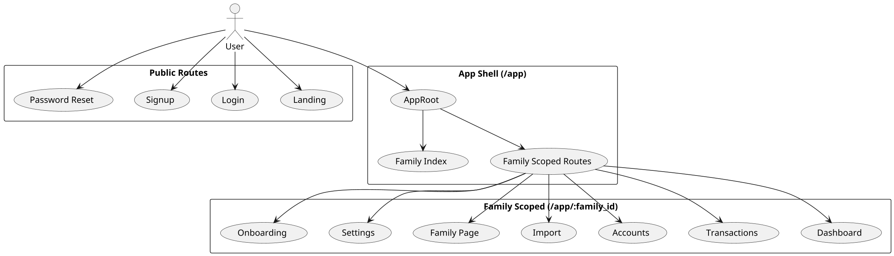
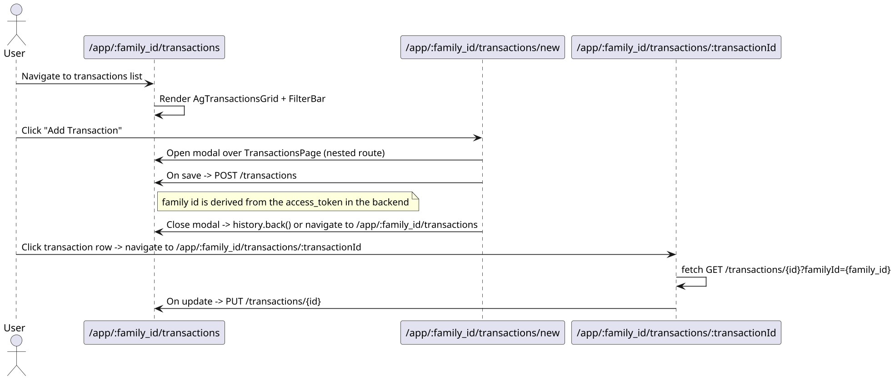
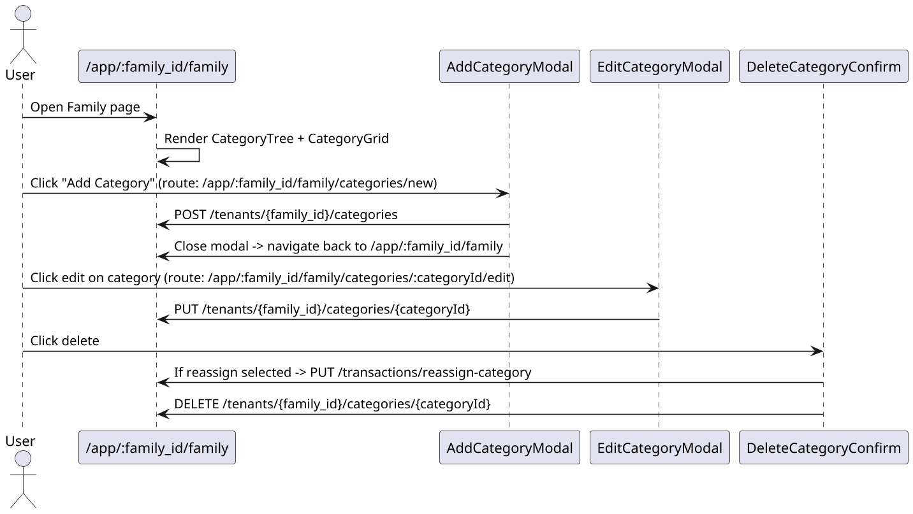
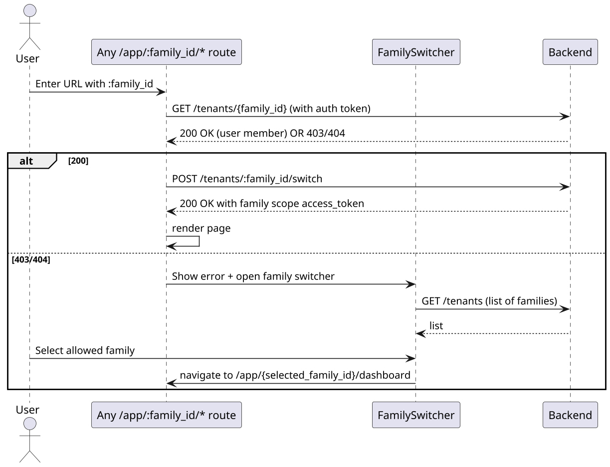

# SPEC-2A - Navigation & Route Map (PlantUML)

## Purpose

Visualize the app's route hierarchy (family-scoped with `:family_id`), modal flows, and key navigation sequences (login → family selection → dashboard, transactions modal flow, category modals, family switch). This diagram is desktop-first but notes mobile behavior where it differs.

---

## Top-level Route Hierarchy (PlantUML)



---

## Modal and Nested Route Flow — Transactions example (PlantUML)



---

## Family Page — Category Modal Flows (PlantUML)



---

## Family Switch & Unauthorized Flow (PlantUML)



---

## Notes & Implementation Guidance

- Implement nested routes using React Router v6 `Outlet` components. Example route config (conceptual):

```
/app
  ├─ / (family index)
  └─ /:family_id
       ├─ /dashboard
       ├─ /transactions
       │    ├─ /new   (modal)
       │    └─ /:transactionId
       ├─ /accounts
       ├─ /family
       │    ├─ /categories/new
       │    └─ /categories/:categoryId/edit
       └─ /settings
```

- Modal routes should render as nested routes that preserve the parent page in the background. On mobile, consider rendering modal routes as full-screen pages.
- Keep the `family_id` param present in all navigation actions; use it as a required param in route definitions and link builders.
- Prefetch family metadata on route change to validate access and reduce flicker.

---

*Author:* Software Architect GPT

